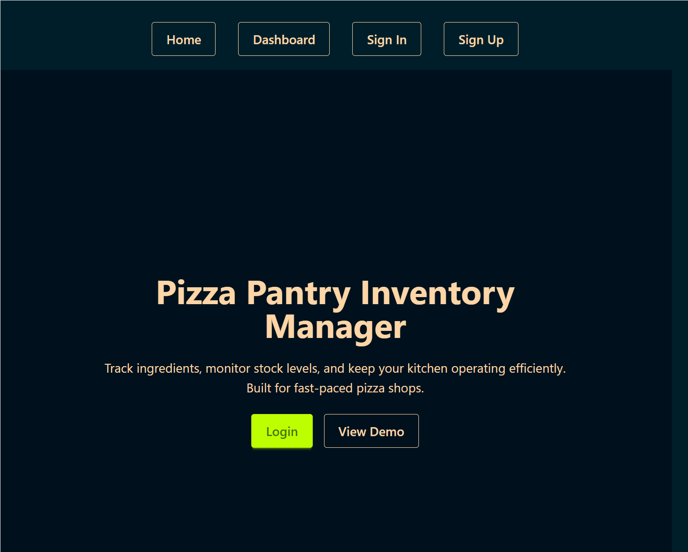
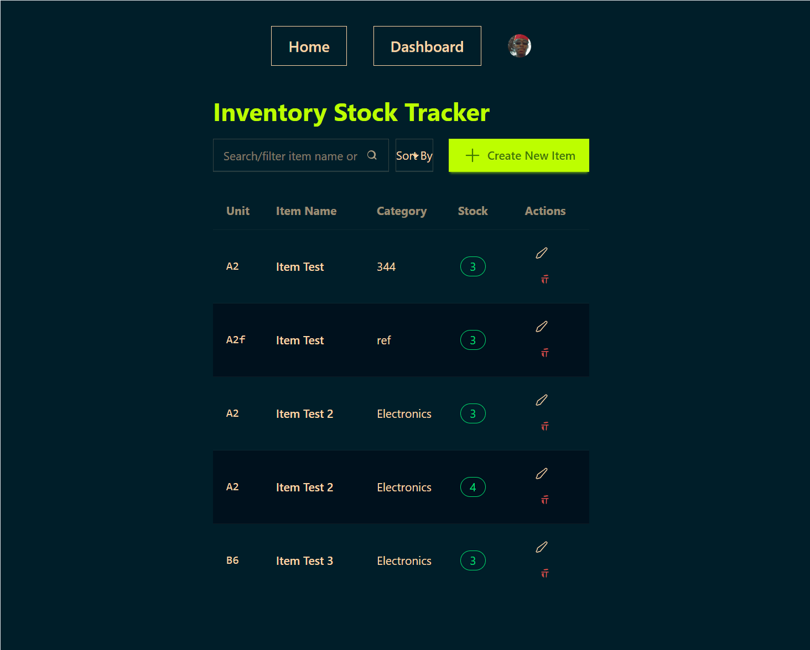

# Pizza-Pantry
A basic inventory management web app for a pizza shop, built in next.js . Users can sign up/log in, view inventory, add new items, edit/update quantities (add/remove), and delete items. 

### Notes
 - used Gemini's suggestion to solve the css import error. 

- Functionality (30): Meets required flows; auth + CRUD + quantity adjust + audit
- Code Quality (20): Structure, modularity, naming, reusability, linting
- UI/UX & Accessibility (20): Clarity, responsiveness, states, a11y
- Validation & Security (15): Input validation, auth checks, safe APIs
- Docs & DevEx (10): README, env/seed, clear run instructions
- Testing/Bonus (5): Any automated tests or optional extras

## Set up
- The project requires clerk api keys and mongodb uri in the process.env file. Such information can be requested from ntpnaane@gmail.com. 
- The standard-default commands apply. 
`` bash
    npm i 
    npm run dev
    npm run build
``
- for easy view, check the deployed version. 

## Deployed 
- https://pizza-pantry-psi.vercel.app/ 

## Pictures / Reel

- 
- 

## References
- https://clerk.com/docs/nextjs/guides/development/custom-sign-in-or-up-page

- https://gemini.google.com/share/886d1f7fd524 